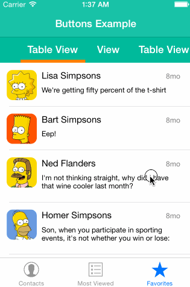

XLPagerTabStrip
---------------

By [XMARTLABS](http://xmartlabs.com).

[](https://github.com/xmartlabs/XLPagerTabStrip/blob/master/LICENSE)
[](https://github.com/xmartlabs/XLPagerTabStrip/releases)

Android [PagerTabStrip](http://developer.android.com/reference/android/support/v4/view/PagerTabStrip.html) for iOS!

**XLPagerTabStrip** is a *Container View Controller* that allows us to switch easily among a collection of view controllers. Pan gesture can be used to move on to next or previous view controller. It shows a interactive indicator of the current, previous, next child view controllers.  



XLPagerTabStrip was originally inspired by [Tell market](http://about.tellmarket.com/) app.

Purpose
--------
 **XLPagerTabStrip** helps us deal with view controllers that have the same relevance for the user like Android PagerTabStrip and PageView do.  Since you're able to navigate between a large amount of view controllers, XLPagerTabStrip is an scalable and nice solution for this problem.


How to use it
--------------

Integrate `XLPagerTabStrip` is as easy as following these steps:

1. Create a UIViewController class that should extend from either `XLSegmentedPagerTabStripViewController`, `XLBarPagerTabStripViewController`, `XLButtonBarPagerTabStripViewController`, `XLTwitterPagerTabStripViewController`.

2. The recently created concrete view controller should conform to `XLPagerTabStripViewControllerDataSource` implementing: `-(NSArray *)childViewControllersForPagerTabStripViewController:(XLPagerTabStripViewController *)pagerTabStripViewController;`

3. (Recomended) Set up your view controllers using a nib file or a Storyboard. We need to connect some IBOutlets (take a look at the [Demo folder](XLPagerTabStrip/Demo)).

4.  Enjoy!

For further details take a look at the [Demo folder](XLPagerTabStrip/Demo) to see the code of examples shown above.

FAQ
----------------------

#####How to change the visible child view controller programmatically

`XLPagerTabStripViewController` provides the following methods to programmatically change the visible child view controller:

```objc
-(void)moveToViewControllerAtIndex:(NSUInteger)index;
-(void)moveToViewControllerAtIndex:(NSUInteger)index animated:(BOOL)animated;
-(void)moveToViewController:(UIViewController *)viewController;
-(void)moveToViewController:(UIViewController *)viewController animated:(BOOL)animated;
```

#####How to change the selected tab (XLButtonBarViewCell) look and feel based on the selected state

`XLButtonBarPagerTabStripViewController` provides a flexible way to customize the look and feel of a `XLButtonBarViewCell` based on the selected state by using blocks. These blocks will be called each time the current cell index changes its value.

```objc
@property (copy) void (^changeCurrentIndexProgressiveBlock)(XLButtonBarViewCell* oldCell, XLButtonBarViewCell *newCell, CGFloat progressPercentage, BOOL indexWasChanged, BOOL animated);
@property (copy) void (^changeCurrentIndexBlock)(XLButtonBarViewCell* oldCell, XLButtonBarViewCell *newCell, BOOL animated);
```
Since the collection cell (tab) is passed as a parameter you have full control on the look and fell change and animation.

Installation
--------------------------

The easiest way to use `XLPagerTabStrip` in your app is via [CocoaPods](http://cocoapods.org/ "CocoaPods").

1. Add the following line in the project's Podfile file:
`pod 'XLPagerTabStrip', '~> 2.0'`.
2. Run the command `pod install` from the Podfile folder directory.


Customization
--------------

The most interesting customizable features are:

* Ability to skip intermediate view controllers when tapped on a "tab".
* Indicators can be added at any position of the screen through storyboard layouts.
* Choose between progressive, non-progressive indicators.
* Add space padding between view controllers.


Requirements
-----------------------------

* ARC
* iOS 7.0 and above


Release Notes
--------------

Version 2.0.0

* Added ability to change look and feel of selected tab.
* `changeCurrentIndexProgressiveBlock` added to `XLButtonBarPagerTabStripViewController`.
* `changeCurrentIndexBlock` added to `XLButtonBarPagerTabStripViewController`.
* indxWasChanged parameter was added to `-(void)pagerTabStripViewController:(XLPagerTabStripViewController *)pagerTabStripViewController updateIndicatorFromIndex:(NSInteger)fromIndex toIndex:(NSInteger)toIndex withProgressPercentage:(CGFloat)progressPercentage indexWasChanged:(BOOL)indexWasChanged;`
* Bug Fix Issue #45: When the current tab is tapped by the user, and later swiping to another tab, the indicator now changes as expected.
* Bug Fix: When scrolling between tabs with progressive indicator, the indicator now scrolls swiftly. It used to jump for an instant.
* Bug Fix Issue #54: Twitter PagerTabStrip wasn't loading the navigation title correctly.
* Bug Fix Issue #32: Demo for Nav Button Bar Example fix.
* Bug Fix Issue #32: Twitter Pager white dots that mark which tab is currently selected is non selectable now.
* Bug Fix Issue #22: moveToViewControllerAtIndex: in viewDidLoad or viewWillAppear is not reflected in buttonBarView.

Version 1.1.1

* Nav Button example added
* Support for iOS 7.0 and above

Version 1.1.0

* Twitter pager added
* Bug fixes and stability improvements

Version 1.0.0

* Initial release

Author
-----------------

[Martin Barreto](https://www.github.com/mtnBarreto "Martin Barreto Github") ([@mtnBarreto](http://twitter.com/mtnBarreto "@mtnBarreto"))

Contributors
----------------

* Washington Miranda
* Martin Pastorin ([@dmpastorin](http://twitter.com/dmpastorin "@dmpastorin"))
* [Full contributors list](https://github.com/xmartlabs/XLPagerTabStrip/graphs/contributors)

Contact
----------------

Any suggestion or question? Please create a Github issue or reach us out.

[xmartlabs.com](http://xmartlabs.com).
[@xmartlabs](http://twitter.com/xmartlabs "@xmartlabs")
