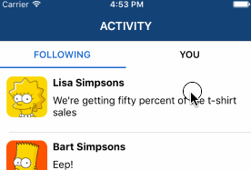
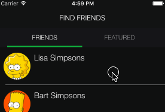
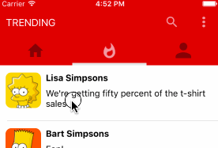
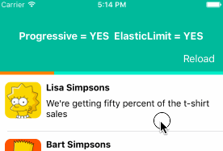
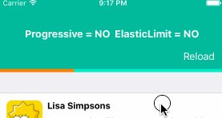
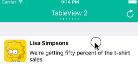
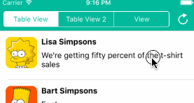

# XLPagerTabStrip

<p align="left">
<a href="https://travis-ci.org/xmartlabs/XLPagerTabStrip"></a>

<a href="https://developer.apple.com/swift"></a>
<a href="https://github.com/Carthage/Carthage"></a>
<a href="https://cocoapods.org/pods/XLPagerTabStrip"></a>
<a href="https://raw.githubusercontent.com/xmartlabs/XLPagerTabStrip/master/LICENSE">
</a>
<!-- <a href="https://codebeat.co/projects/github-com-xmartlabs-xlpagertabstrip"></a> -->

</p>

Made with ❤️ by [XMARTLABS](http://xmartlabs.com).

Android [PagerTabStrip](http://developer.android.com/reference/android/support/v4/view/PagerTabStrip.html) for iOS!

**XLPagerTabStrip** is a *Container View Controller* that allows us to switch easily among a collection of view controllers. Pan gesture can be used to move on to next or previous view controller. It shows a interactive indicator of the current, previous, next child view controllers.

<table>
  <tr>
    <th></th>
    <th></th>
    <th></th>
    <th></th>
  </tr>
</table>

## Getting involved

* If you **want to contribute** please feel free to **submit pull requests**.
* If you **have a feature request** please **open an issue**.
* If you **found a bug** or **need help** please **check older issues, [FAQ](#faq) and threads on [StackOverflow](http://stackoverflow.com/questions/tagged/XLPagerTabStrip) (Tag 'XLPagerTabStrip') before submitting an issue**.

**Before contribute check the [CONTRIBUTING](CONTRIBUTING.md) file for more info.**

If you use **XLPagerTabStrip** in your app we would love to hear about it! Drop us a line on [twitter](https://twitter.com/xmartlabs).

## Pager Types

The library provides 4 different ways to show the view controllers.

### Button Bar

This is likely the most common pager type. It's used by many well-known apps such as instagram, youtube, skype, and many others.


### Bar

This mode doesn't show a title neither an image. It only shows a bar that indicates the current view controller.



### Twitter

A long time ago, the twitter app made use of this type of pager in the app main screen.



### Segmented

This mode uses a `UISegmentedControl` to indicate which view controller is being displayed.



## Usage

Basically, we just need to provide the list of child view controllers to show, and these view controllers should provide the information (title or image) that will be shown in the associated indicator.

Let's see the steps to do this:

##### Choose which type of pager we want to create

First, we must choose the type of pager we want to create.  Depending on our choice, we will have to create a view controller that extends from one of the following controllers: `TwitterPagerTabStripViewController`, `ButtonBarPagerTabStripViewController`, `SegmentedPagerTabStripViewController`, `BarPagerTabStripViewController`.

> All these built-in pager controllers extend from the base class `PagerTabStripViewController`.
> You can also make your custom pager controller by extending directly from `PagerTabStripViewController` in the event that no pager menu type fits your needs.

```swift
import XLPagerTabStrip

class MyPagerTabStripName: ButtonBarPagerTabStripViewController {
  ..
}
```

##### Connect outlets and add layout constraints

We strongly recommend using IB to set up our page controller views.

Drag a `UIViewController` into the storyboard and set up its class with your pager controller (`MyPagerTabStripName`).
Drag a `UIScrollView` into your view controller view and connect `PagerTabStripViewController` `containerView` outlet with the scroll view.

Depending on which type of paging view controller you are working with you may have to connect more outlets.

For `BarPagerTabStripViewController`, we should connect `barView` outlet. barView type is UIView. `ButtonBarPagerTabStripViewController` requires us to connect `buttonBarView` outlet. `buttonBarView` type is `ButtonBarView` which extends from `UICollectionView`. `SegmentedPagerTabStripViewController` has a `segmentedControl` outlet; if the outlet is not connected the library try to set up the navigationItem `titleView` property using a `UISegmentedControl`. `TwitterPagerTabStripViewController` doesn't require us to connect any additional outlet.

> The example project contains a example for each pager controller type and we can look into it to see how views were added and how outlets were connected.

##### Provide the view controllers that will appear embedded into the PagerTabStrip view controller

You can provide the view controllers by overriding `func viewControllers(for: pagerTabStripController: PagerTabStripViewController) -> [UIViewController]` method.

```swift
override public func viewControllers(for pagerTabStripController: PagerTabStripViewController) -> [UIViewController] {
  return [MyEmbeddedViewController(), MySecondEmbeddedViewController()]
}
```

> The method above is the only method declared in `PagerTabStripDataSource` protocol. We don't need to explicitly conform to it since base pager class already does it.


##### Provide information to show in each indicator

Every UIViewController that will appear within the PagerTabStrip needs to provide either a title or an image.
In order to do so they should conform to `IndicatorInfoProvider` by implementing `func indicatorInfo(for pagerTabStripController: PagerTabStripViewController) -> IndicatorInfo`
 which provides the information required to show the PagerTabStrip menu (indicator) associated with the view controller.

```swift
class MyEmbeddedViewController: UITableViewController, IndicatorInfoProvider {

  func indicatorInfo(for pagerTabStripController: PagerTabStripViewController) -> IndicatorInfo {
    return IndicatorInfo(title: "My Child title")
  }
}
```

**For a detailed step-by-step guide about how to use the library, please check out this community [blog post](https://medium.com/michaeladeyeri/how-to-implement-android-like-tab-layouts-in-ios-using-swift-3-578516c3aa9).**

That's it! We're done! 🍻🍻


## Customization

##### Pager Behaviour

The pager indicator can be updated progressive as we swipe or at once in the middle of the transition between the view controllers.
By setting up `pagerBehaviour` property we can choose how the indicator should be updated.

```swift
public var pagerBehaviour: PagerTabStripBehaviour
```

```swift
public enum PagerTabStripBehaviour {
    case common(skipIntermediteViewControllers: Bool)
    case progressive(skipIntermediteViewControllers: Bool, elasticIndicatorLimit: Bool)
}
```

Default Values:
```swift
// Twitter Type
PagerTabStripBehaviour.common(skipIntermediateViewControllers: true)
// Segmented Type
PagerTabStripBehaviour.common(skipIntermediateViewControllers: true)
// Bar Type
PagerTabStripBehaviour.progressive(skipIntermediateViewControllers: true, elasticIndicatorLimit: true)
// ButtonBar Type
PagerTabStripBehaviour.progressive(skipIntermediateViewControllers: true, elasticIndicatorLimit: true)
```

As you might have noticed, `common` and `progressive` enumeration cases have `skipIntermediateViewControllers` and `elasticIndicatorLimit` associated values.

`skipIntermediateViewControllers` allows us to skip intermediate view controllers when a tab indicator is tapped.

`elasticIndicatorLimit` allows us to tension the indicator when we reach a limit, I mean when we try to move forward from last indicator or move back from first indicator.

##### PagerTabStripDelegate & PagerTabStripIsProgressiveDelegate

Normally we don't need to implement these protocols because each pager type already conforms to it in order to properly update its indicator. However, there may be some scenarios when overriding a method may come in handy.

```swift
public protocol PagerTabStripDelegate: class {

    func updateIndicator(for viewController: PagerTabStripViewController, fromIndex: Int, toIndex: Int)
}

public protocol PagerTabStripIsProgressiveDelegate : PagerTabStripDelegate {

    func updateIndicator(for viewController: PagerTabStripViewController, fromIndex: Int, toIndex: Int, withProgressPercentage progressPercentage: CGFloat, indexWasChanged: Bool)
}
```

> Again, the method invoked by the library depends on the `pagerBehaviour` value.


### ButtonBar Customization

```swift

settings.style.buttonBarBackgroundColor: UIColor?
// buttonBar minimumInteritemSpacing value, note that button bar extends from UICollectionView
settings.style.buttonBarMinimumInteritemSpacing: CGFloat?
// buttonBar minimumLineSpacing value
settings.style.buttonBarMinimumLineSpacing: CGFloat?
// buttonBar flow layout left content inset value
settings.style.buttonBarLeftContentInset: CGFloat?
// buttonBar flow layout right content inset value
settings.style.buttonBarRightContentInset: CGFloat?

// selected bar view is created programmatically so it's important to set up the following 2 properties properly
settings.style.selectedBarBackgroundColor = UIColor.black
settings.style.selectedBarHeight: CGFloat = 5

// each buttonBar item is a UICollectionView cell of type ButtonBarViewCell
settings.style.buttonBarItemBackgroundColor: UIColor?
settings.style.buttonBarItemFont = UIFont.systemFont(ofSize: 18)
// helps to determine the cell width, it represent the space before and after the title label
settings.style.buttonBarItemLeftRightMargin: CGFloat = 8
settings.style.buttonBarItemTitleColor: UIColor?
// in case the barView items do not fill the screen width this property stretch the cells to fill the screen
settings.style.buttonBarItemsShouldFillAvailiableWidth = true
// only used if button bar is created programmatically and not using storyboards or nib files as recommended.
public var buttonBarHeight: CGFloat?
```

**Important:** Settings should be called before `viewDidLoad` is called.
```swift
override func viewDidLoad() {
   self.settings.style.selectedBarHeight = 2
   self.settings.style.selectedBarBackgroundColor = UIColor.white

   super.viewDidLoad()
}
```

#####  Update cells when selected indicator changes

We may need to update the indicator cell when the displayed view controller changes. The following function properties help to accomplish that. Depending on our pager `pagerBehaviour` value we will have to set up `changeCurrentIndex` or `changeCurrentIndexProgressive`.

```swift
public var changeCurrentIndex: ((oldCell: ButtonBarViewCell?, newCell: ButtonBarViewCell?, animated: Bool) -> Void)?
public var changeCurrentIndexProgressive: ((oldCell: ButtonBarViewCell?, newCell: ButtonBarViewCell?, progressPercentage: CGFloat, changeCurrentIndex: Bool, animated: Bool) -> Void)?
```

Let's see an example:

```swift
changeCurrentIndexProgressive = { (oldCell: ButtonBarViewCell?, newCell: ButtonBarViewCell?, progressPercentage: CGFloat, changeCurrentIndex: Bool, animated: Bool) -> Void in
    guard changeCurrentIndex == true else { return }

    oldCell?.label.textColor = UIColor(white: 1, alpha: 0.6)
    newCell?.label.textColor = UIColor.white

    if animated {
        UIView.animate(withDuration: 0.1, animations: { () -> Void in
            newCell?.transform = CGAffineTransform(scaleX: 1.0, y: 1.0)
            oldCell?.transform = CGAffineTransform(scaleX: 0.8, y: 0.8)
        })
    }
    else {
        newCell?.transform = CGAffineTransform(scaleX: 1.0, y: 1.0)
        oldCell?.transform = CGAffineTransform(scaleX: 0.8, y: 0.8)
    }
}
```

### Bar Type Customization

```swift
settings.style.barBackgroundColor: UIColor?
settings.style.selectedBarBackgroundColor: UIColor?
// barHeight is only set up when the bar is created programmatically and not using storyboards or xib files as recommended.
settings.style.barHeight: CGFloat = 5
```

### Twitter Type Customization

```swift
settings.style.dotColor = UIColor(white: 1, alpha: 0.4)
settings.style.selectedDotColor = UIColor.white
settings.style.portraitTitleFont = UIFont.systemFont(ofSize: 18)
settings.style.landscapeTitleFont = UIFont.systemFont(ofSize: 15)
settings.style.titleColor = UIColor.white
```

### Segmented Type Customization

```swift
settings.style.segmentedControlColor: UIColor?
```


## Requirements

* iOS 9.3+
* Xcode 10.2+

## Examples

Follow these 3 steps to run Example project: Clone XLPagerTabStrip repository, open XLPagerTabStrip workspace and run the *Example* project.

## Installation

### CocoaPods

[CocoaPods](https://cocoapods.org/) is a dependency manager for Cocoa projects.

To install XLPagerTabStrip, simply add the following line to your Podfile:

```ruby
pod 'XLPagerTabStrip', '~> 9.0'
```

### Carthage

[Carthage](https://github.com/Carthage/Carthage) is a simple, decentralized dependency manager for Cocoa.

To install XLPagerTabStrip, simply add the following line to your Cartfile:

```ogdl
github "xmartlabs/XLPagerTabStrip" ~> 9.0
```

## FAQ

#### How to change the visible child view controller programmatically

`PagerTabStripViewController` provides the following methods to programmatically change the visible child view controller:

```swift
func moveToViewController(at index: Int)
func moveToViewController(at index: Int, animated: Bool)
func moveTo(viewController: UIViewController)
func moveTo(viewController: UIViewController, animated: Bool)
```


#### How to migrate from Swift 2 to Swift 3 <a name="migrate"></a>

Check out [our migration guide](https://github.com/xmartlabs/XLPagerTabStrip/blob/master/Migration.md)

## Author

* [Martin Barreto](https://github.com/mtnBarreto) ([@mtnBarreto](https://twitter.com/mtnBarreto))

## Change Log

This can be found in the [CHANGELOG.md](CHANGELOG.md) file.
